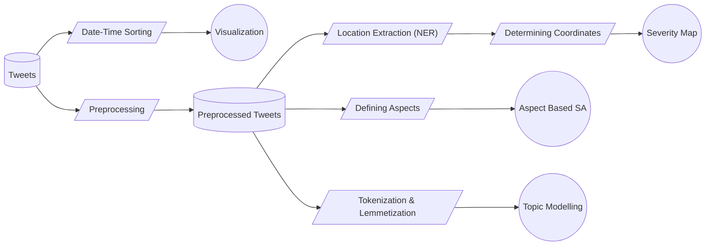

# RumbleRadar : Suite of Natural Language Processing (NLP) methodologies designed for earthquake response analysis leveraging Twitter

In the wake of natural disasters such as earthquakes, timely and effective response is crucial for minimizing damage and saving lives. Micro blogging platforms, particularly Twitter, have emerged as valuable sources of real-time information during such events due to easy access to internet and increase of users day by day. This project explores the potential of leveraging Twitter data for earthquake response analysis. By employing machine learning algorithms and natural language processing (NLP) techniques, this project explores the underlying information available on such online platforms and tries to extract relevant information from tweets posted during earthquake events.

## Architecture

Following diagram summarizes the whole procedure of the earthquake response analysis which has been implemented:

## Dataset

Our dataset contains 5 key data frames as shown below, each containing crucial crowdsource information about respective earthquake event:

|    Dataset     |Total Entries |Text Type  | Magnitude  |
|----------------|--------------|-----------|------------|
|Haiti, 2010     |5182          | Messages  | 7.0        |
|Mexico, 2017    |1380          | Tweets    | 7.1        |
|Iraq-Iran, 2017 |597           | Tweets    | 7.3        |
|Turkey, 2023    |36777         | Tweets    | 7.8        |
|Japan, 2024     |493           | Tweets    | 7.6        |

The [Haiti, 2010 dataset](https://github.com/Ryota-Kawamura/AI-for-Good-Specialization) is containing messages which were directly sent to organizations by affected people. The sole purpose of including this dataset into the research is to get a detailed idea of sentiments of users on different aspect for ABSA (Aspect Based Sentiment Analysis). The other datasets mainly contain tweet texts with respective day when it was tweeted. The Mexico, Iraq-Iran, and Turkey datasets are collected through [CrisisNLP website](https://crisisnlp.qcri.org/crisismmd) and the Japan dataset contains tweets gathered from Twitter website using [Tweepy library](https://github.com/tweepy/tweepy). The last column of the table contains magnitude of earthquake for each event.

                
## Graphical Representation & Variation Over Time

Analyzing the pattern of tweets over time reveals fluctuations in public awareness and engagement with earthquake events. Also, visualization of different events in single time frame helps to analyze and compare the impact of the same. *datatimeline.py* file outputs a webapp which plots such different graphs of the datasets for better visualization and to understand the rate of tweets per day.
