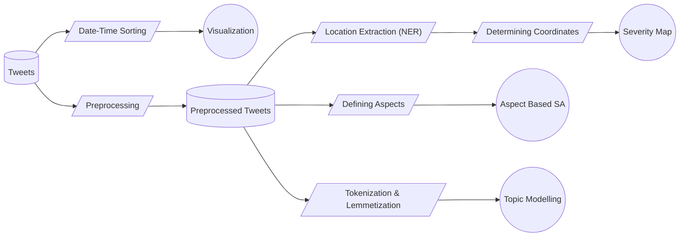

# RumbleRadar : Suite of Natural Language Processing (NLP) methodologies designed for earthquake response analysis leveraging Twitter

In the wake of natural disasters such as earthquakes, timely and effective response is crucial for minimizing damage and saving lives. Micro blogging platforms, particularly Twitter, have emerged as valuable sources of real-time information during such events due to easy access to internet and increase of users day by day. This project explores the potential of leveraging Twitter data for earthquake response analysis. By employing machine learning algorithms and natural language processing (NLP) techniques, this project explores the underlying information available on such online platforms and tries to extract relevant information from tweets posted during earthquake events.

## Architecture

Following diagram summarizes the whole procedure of the earthquake response analysis which has been implemented:

## Dataset

Our dataset contains 5 key data frames as shown below, each containing crucial crowdsource information about respective earthquake event:

|    Dataset     |Total Entries |Text Type  | Magnitude  |
|----------------|--------------|-----------|------------|
|Haiti, 2010     |5182          | Messages  | 7.0        |
|Mexico, 2017    |1380          | Tweets    | 7.1        |
|Iraq-Iran, 2017 |597           | Tweets    | 7.3        |
|Turkey, 2023    |36777         | Tweets    | 7.8        |
|Japan, 2024     |493           | Tweets    | 7.6        |

The [Haiti, 2010 dataset](https://github.com/Ryota-Kawamura/AI-for-Good-Specialization) is containing messages which were directly sent to organizations by affected people. The sole purpose of including this dataset into the research is to get a detailed idea of sentiments of users on different aspect for ABSA (Aspect Based Sentiment Analysis). The other datasets mainly contain tweet texts with respective day when it was tweeted. The Mexico, Iraq-Iran, and Turkey datasets are collected through [CrisisNLP website](https://crisisnlp.qcri.org/crisismmd) and the Japan dataset contains tweets gathered from Twitter website using [Tweepy library](https://github.com/tweepy/tweepy). The last column of the table contains magnitude of earthquake for each event.

                
## Graphical Representation & Variation Over Time

Analyzing the pattern of tweets over time reveals fluctuations in public awareness and engagement with earthquake events. Also, visualization of different events in single time frame helps to analyze and compare the impact of the same. *datatimeline.py* file outputs a webapp which plots such different graphs of the datasets for better visualization and to understand the rate of tweets per day.

## Location Extraction & Severity Map

Plotting a severity map provides a visual representation of the distribution and intensity of damage, allowing emergency responders, government agencies, and humanitarian organizations to prioritize their efforts effectively. Using to Geo-tagged tweets can be useful and even though Twitter Developers account provides [facility to extract Geo-tagged tweets](https://developer.twitter.com/en/docs/tutorials/advanced-filtering-for-geo-data#:~:text=Prevalence%3A%20~30%2D40%25,including%20a%20%22location%22%20field.), the method fails in some cases as described below:

1. While Geo-tags provide explicit location information, they are often sparse or inaccurate due to user preferences, privacy settings, or device limitations. Around only 30 to 40 percentage of Tweets contain some profile location information.
2. Another case is when the tweet : _"Help! My nephew is stuck at Tokyo since 2 days and no food or shelter is available.. #JapanEarthquake2024"_ is Geo-tagged as location: **Delhi, IN**. The point is even though the help is being asked for the person at Tokyo,
the severity map will indicate the crisis at Delhi.

Our approach is to use the named entity recognition(NER); an NLP technique, to solve the issue. We don’t use the location which is tagged on tweet by Twitter but we extract the locations mentioned in the tweet itself. 

After preprocessing, we perform NER using spaCy library on each tweet and extract locations (LOC) and geo-political entities (GPE). Convert the LOC and GPE into their respective co-ordinates using geopy library and plot them with their frequency of occurrence in entire dataset.

## Aspect Based Sentiment Analysis (ABSA)

As a mediator between affected people and service providers, we need to dissect text data and extract opinions or sentiments about specific aspects or features of which the user has tweeted about. In the context of earthquake response analysis on Twitter, Aspect
Based Sentiment Analysis (ABSA) can play a vital role in understanding public sentiment towards various aspects related to the disaster, such as government response, relief efforts, infrastructure damage, etc. Traditional sentiment analysis methods may overlook
nuanced opinions expressed within tweets, whereas ABSA enables a more granular analysis by identifying sentiment towards individual aspects mentioned in the text.

To extract the required sentiments of users on various aspects of the earthquake event, total 9 key aspects and the words related to them have been defined as followed:

| Aspect             | Related Words                                                                                |
|--------------------|----------------------------------------------------------------------------------------------|
| Food               | "food", "hungry", "starving", "food shortage", "meal"                                        |
| Injury             | "injured", "injuries", "injury", "hurt", "wounded", "bleeding"                               |
| Shelter            | "shelter", "housing", "homeless", "evacuation center", "temporary shelter"                   |
| Death              | "death", "died", "dying", "die", "will die"                                                  |
| Property Damage    | "damage", "destroyed", "ruined", "collapsed", "broken", "infrastructure", "roads", "bridges" |
| Rescue Efforts     | "rescue", "rescued", "rescuing", "aid", "assistance", "help"                                 |
| Fear and Panic     | "fear", "panic", "terrified", "scared", "frightened", "trauma", "PTSD", "stress", "anxiety"  |
| Relief and Support | "relief", "support", "help", "assistance", "aid"                                             |
| Government Response| "government", "officials", "response", "relief efforts", "emergency services"                |

Using VADER sentiment analyzer, we go through each terms for each aspect to perform ABSA.

## Topic Modelling

Twitter conversations during earthquake events can cover a wide range of topics, including eyewitness reports, safety information, damage assessments, and humanitarian efforts. Here, we perform topic modelling on Turkey, 2023 dataset using Latent Dirichlet Allocation (LDA). 

## Future Integrations

Looking ahead, integrating real-time data streams from Twitter could enhance the depth and accuracy of earthquake response analysis. Furthermore, exploring advanced machine learning models and ensemble techniques for sentiment analysis and topic modeling may
yield more nuanced insights from the Twitter data. Collaborating with social media platforms to access additional data sources and implementing interactive visualization tools for stakeholders could further improve the usability and impact of this analysis in future
disaster management scenarios.

